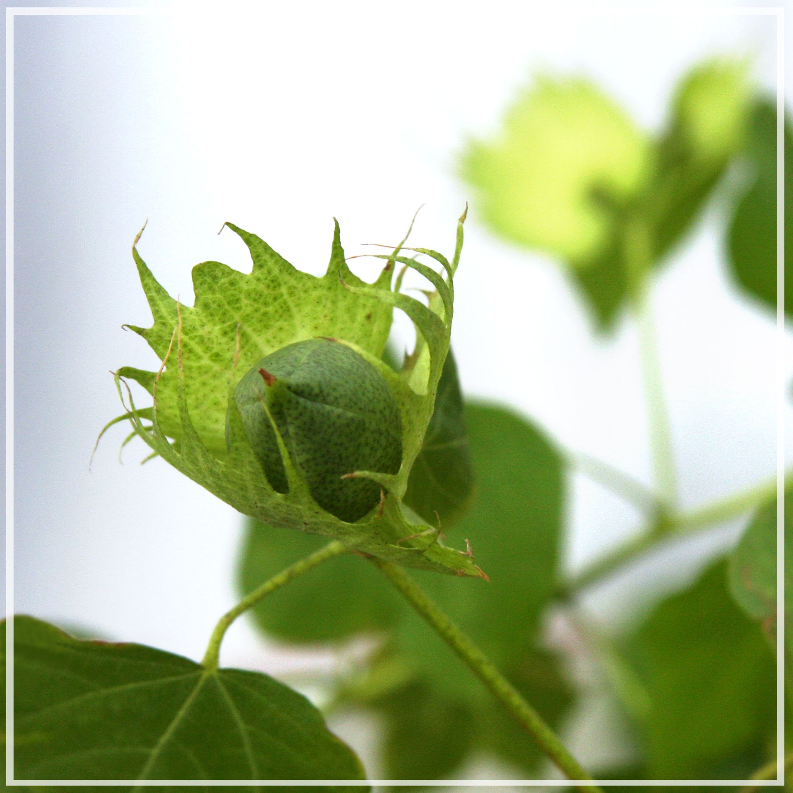
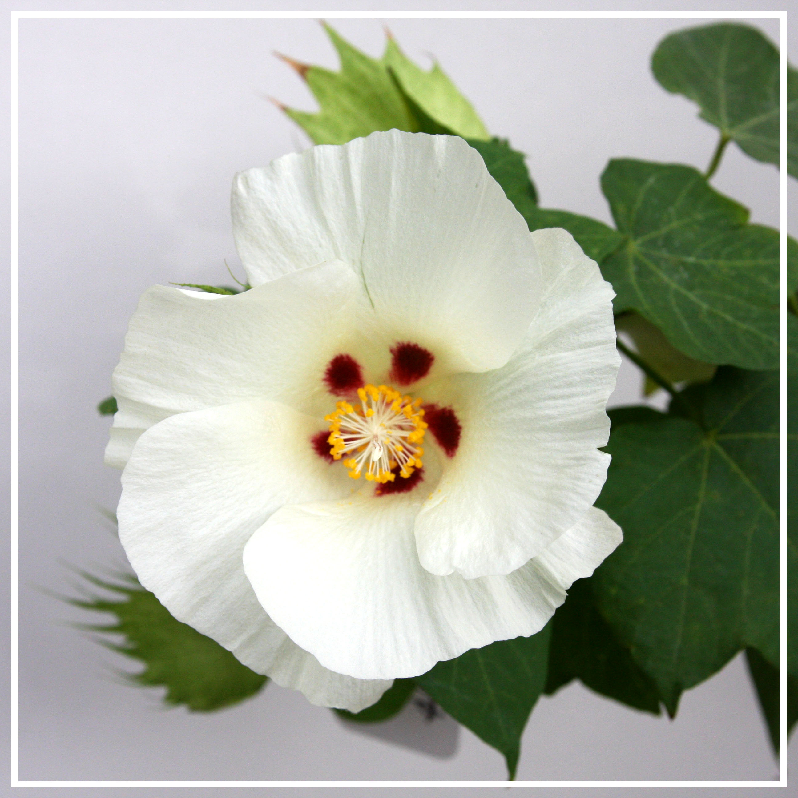

# Comparative population genomics of relictual Caribbean island *Gossypium hirsutum*

  
   
   
   
   
	
	 
	 

#
### Manuscript link: to be updated
### Abstract 
*Gossypium hirsutum* is the world’s most important source of cotton fiber, yet the diversity and population structure of its wild forms remain largely unexplored. The complex domestication history of G. hirsutum combined with its reciprocal introgression with a second domesticated species, *G. barbadense*, has generated a wealth of morphological forms and feral derivatives of both species and their interspecies recombinants, which collectively are scattered across a large geographic range in arid regions of the Caribbean basin. In this study, we aimed to assess genetic diversity within and among populations from two Caribbean islands, Puerto Rico (n = 43, five sites) and Guadeloupe (n = 25, one site), which contain putative wild and introgressed forms. Using whole genome resequencing data combined with a phylogenomic framework derived from a broader genomic survey, we parsed individuals into feral derivatives and truly wild forms. Feral cottons variously show genetic and morphological resemblance to the domesticated cottons, and vary greatly in genetic variation and heterozygosity, reflecting a complex history of interspecific and intraspecific gene flow that is spatially highly variable in its effects. Furthermore, wild cottons in both Caribbean islands appear to be relatively inbred, especially the Guadeloupe samples. Our results highlight the dynamics of population demographics in relictual wild cottons that experienced profound genetic bottlenecks associated with habitat destruction superimposed on a natural pattern of widely scattered populations. These results have implications for conservation of wild diversity in *G. hirsutum*. 

#
#### Rawreads trimming to final VCF construction: [00_BuildingGVCFs](https://github.com/Wendellab/CaribbeanAD1/tree/main/00_BuildingGVCFs)

#### Identifying wild Gb samples: [01_OutgroupSelection_n51](https://github.com/Wendellab/CaribbeanAD1/tree/main/01_OutgroupSelection_n51)

#### Identifying feral Gh samples: [02_FeralCottonPR_n145](https://github.com/Wendellab/CaribbeanAD1/tree/main/02_FeralCottonPR_n145)

#### Identifying wild Gh relationships: [03_WildCottonPCAStructure_n86_n128](https://github.com/Wendellab/CaribbeanAD1/tree/main/03_WildCottonPCAStructure_n86_n128)

#### Identifying gene flow/introgression in Caribbean Gh: [04_TreemixDsuit_n128](https://github.com/Wendellab/CaribbeanAD1/tree/main/04_TreemixDsuit_n128)

#### Extracting whole plastomes and coding genes: [05_plastome_n123](https://github.com/Wendellab/CaribbeanAD1/tree/main/05_plastome_n123)

#### Comparing the genetic diversity and population differentiation in Caribbean cotton: [06_Pixy_n121](https://github.com/Wendellab/CaribbeanAD1/tree/main/06_Pixy_n121)

#### Comparing the inbreeding and heterzygosity level in Caribbean cotton: [07_ROH_He_121](https://github.com/Wendellab/CaribbeanAD1/tree/main/07_ROH_He_121)

